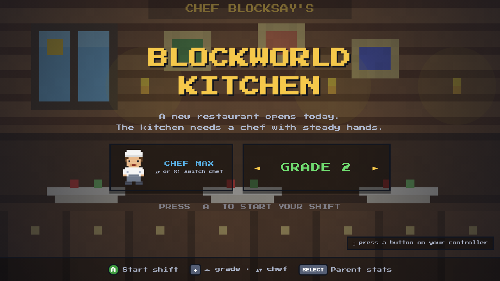
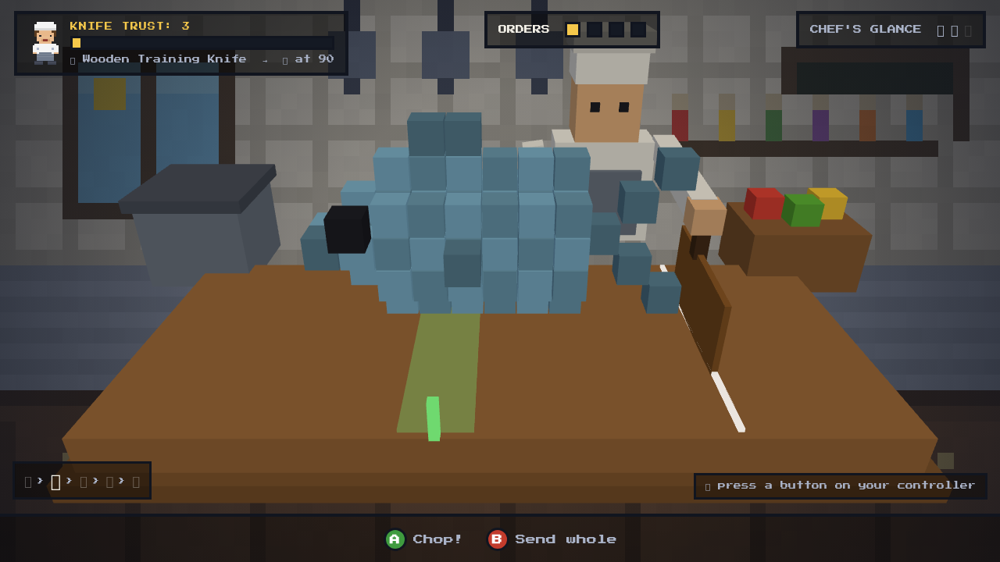

# 🔪🧱 Blockworld Kitchen

A Minecraft-styled cooking game designed for kids with **ADHD** and
**written-expression learning challenges** (dysgraphia-spectrum spelling and
writing difficulties). The player is a young chef earning the kitchen's trust
with steady knife work, spelling order tickets, and building their own voxel
restaurant day by day.

Every mechanic is a disguised therapy target — response inhibition, spelling,
working-memory compensation, and self-regulation — wrapped in a game that
respects the player's intelligence and never punishes mistakes.

**Plays entirely with an Xbox or PlayStation controller.** No keyboard skills
required — and that's deliberate: spelling happens on a controller-navigated
QWERTY grid (like console name entry), which quietly teaches keyboard layout
for the day the player graduates to typing.

Everything is generated in code — pixel-art kitchen and dining-room
backgrounds, the selectable chef avatars (Chef Max / Chef Maya), the blocky
customers, the lo-fi background music, and all sound effects. No asset files.




---

## How to run it

```bash
npm install     # first time only
npm run dev
```

Open the printed URL (usually `http://localhost:5173`) in **Chrome or Edge**.
Connect a controller via USB or Bluetooth, press any button on it, and you're
cooking.

> Sound matters: the chef speaks the orders and spelling words aloud (browser
> speech synthesis), which is part of the therapy design. Volume on.

To make a hostable build: `npm run build` → static site in `dist/`.

### Controls

| Controller | Action |
|---|---|
| **A / Cross** | confirm, pick letter, **chop** |
| **B / Circle** | erase letter, **send dish out whole (no-cut orders!)** |
| **X / Square** | hear the word again (unlimited, free); switch chef on the title screen |
| **Y / Triangle** | Chef's Glance — re-shows the word briefly (limited per night) |
| **D-pad / left stick** | navigate, change grade on the title screen |
| **Start / Options** | pause |
| **Select / Share** | parent dashboard |

Keyboard fallback: arrows, `Enter`=A, `Backspace`=B, `1`=hear, `2`=glance,
`Esc`=pause, `Tab`=parent dashboard. Letter keys type directly into spelling —
a built-in growth path from controller to keyboard.

---

## Grade levels (Alberta curriculum aligned)

Pick **Kindergarten–Grade 6** with the d-pad on the title screen. Word banks follow the
word-study progression of the
[Alberta English Language Arts and Literature (2022) curriculum](https://curriculum.learnalberta.ca/curriculum/en):

| Grade | Word focus | Example words |
|---|---|---|
| K | Letter sounds, simple CVC | EGG, JAM, CUP |
| 1 | CVC words, blends, digraphs, silent-e | EGG, CHIP, CAKE |
| 2 | Vowel teams, common patterns, early 2-syllable | PEACH, HONEY, CARROT |
| 3 | Compound + multisyllabic words, common affixes | PANCAKE, SANDWICH |
| 4 | Complex patterns, longer multisyllabic | CINNAMON, PINEAPPLE |
| 5 | Prefixes/suffixes, irregular plurals (f/o/y) | TOMATOES, LOAVES, CASSEROLE |
| 6 | Loan words, Greek/Latin-derived, hard morphology | GUACAMOLE, INGREDIENT, MOZZARELLA |

Grade also scales the whole game: word-flash time shrinks, cut counts and
cut-line speed rise, and the chef calls more "HOLD!" inhibition tests. Within
each grade there are three tiers that **auto-adapt** to the player's recent
first-try success — no grinding mastered material, no walls. Kindergarten and
Grade 1 nights are shorter (3 orders instead of 4) to match younger attention
spans.

---

## Music, whispers & voices

**Six original chiptunes** rotate night by night — from the bouncy
"Block Party Bounce" to the sneaky "Midnight Snack" — all switching to slow
warm pads during the sharpening wind-down. While the player is spelling, the
music **whispers the target word** once every 30 seconds — gentle ambient
rehearsal, never nagging.

The chef speaks with one of two voices, switchable on the pause menu: the
**friendly helper** or **fiery Chef Blocksay** — a deep, quick, very British
head-chef delivery (same kind words, much more drama). Pause menu (**Start**):
**Y** toggles music, **X** toggles the voice.

## The game loop (one "day" ≈ 10–15 minutes)

1. **Tonight's Menu** — the 4 words are previewed up front (pre-exposure sets
   the player up to succeed; it's also a visual schedule).
2. **Dinner service** — for each order:
   - The chef **speaks** the order; the word **flashes** visually, then hides.
   - The player spells it on the controller letter grid.
   - Then cuts the ingredient at the **Knife Station** — a real voxel model
     (the FISH looks like a fish, the CAKE has tiers and a cherry), with the
     chosen chef standing at the board swinging the knife on every cut.
3. **Sharpening wind-down** — slow, breathing-paced whetstone strokes.
4. **Results** — stars, Knife Trust, possible knife unlock, and a **word
   recap**: every word from tonight, spelled correctly, one more look. The
   final order of every night is the **⭐ Daily Special** — double trust on
   its spelling, a built-in finale.
5. **Build** — place an earned decoration block in a persistent restaurant.
   **Every block is a real kitchen upgrade**: the Potted Plant grants an extra
   Chef's Glance, the Old Clock keeps words on screen longer, the Kitchen Cat
   protects a spelling streak once a night, the Trophy pays bonus trust on
   perfect cuts, the Lantern widens the cut zone, the Fish Tank calms the cut
   line… Active powers are shown on the menu screen each night, so the
   restaurant the player builds literally makes them a stronger chef.

Other touches: a visual countdown bar shows exactly how long the word stays on
screen (visible time, an ADHD support), consecutive first-try spellings build
**streaks** with confetti, bonus trust, and a tracked **personal best**, and
every served dish gets a reaction from a blocky customer (Miner Mo, Builder
Bea, Redstone Rex…). The sharpening wind-down shows the player's actual
trust-tier knife on the whetstone, edge gleaming brighter with every
breathing-paced stroke. During spelling the dish name is deliberately hidden —
"Vanilla Milkshake" on screen would spell M-I-L-K for you.

**The Recipe Book** (B on the title screen) collects every word ever spelled
first-try as a mastered recipe stamp, grade by grade — locked recipes show as
mystery cards to hunt down. 170+ food words across the seven grade bands.

The final order is announced as **"LAST ORDER OF THE NIGHT"** — a built-in
transition warning for kids who struggle to stop a preferred activity.

## How each mechanic maps to a therapy target

| Mechanic | Target |
|---|---|
| Spelling order tickets (word heard + flashed, then spelled) | Spelling/written expression — without the fine-motor handwriting bottleneck |
| QWERTY-arranged letter grid | Keyboard geography for future typing/assistive tech |
| Chef's Glance (re-show the word, limited uses) | Working-memory compensation: turn *heard* (weak channel) into *seen* (strong channel) |
| Wrong spelling → funny wrong dish, correct letters kept | Errors stay playful; retries always shrink the problem |
| Knife Station: cut only when the moving line is in the zone | "Slow down for accuracy" — counters impulsive rushing |
| **WAIT… / NOW!** hold calls | Go/no-go response inhibition (the core ADHD deficit) |
| No-cut orders (press B, never A) | Withholding as a *win condition* — impulse control framed as elite chef discipline |
| **Knife Trust** progression (wooden → stone → iron → gold → diamond) | Identity-based motivation: the kitchen trusts you with sharper tools because you've shown control |
| Sharpening wind-down with breath cues | Disguised mindfulness/regulation practice |
| Persistent restaurant building, where every block grants a kitchen power | Creation-based reward with real in-game meaning (works where sticker charts don't) |
| Menu preview, order-progress dots, last-order warning | Visual schedule + predictable transitions |
| Grade bands + adaptive tiers | Right-sized challenge; no repetition of mastered material |

### Parent dashboard

Press **Select** (or `Tab`) anywhere: first-try spelling %, hint usage,
WAIT-call success rate, no-cut success rate, and cut precision — measurable
movement on the skills above. `Shift+R` on the dashboard resets all progress
(keyboard-only, so kids can't trigger it).

Progress saves automatically in the browser (localStorage).

## Suggested house rule

Intense physical movement is one of the best-evidenced regulation tools for
ADHD. Consider a real-world "shift change": **10 jumping jacks or a hallway
sprint before starting the next in-game day.**

## Development

```bash
npm run dev      # dev server with hot reload
npm run build    # production build → dist/
npm test         # builds, then plays a full game day headlessly (Playwright)
```

The E2E test (`scripts/smoke.mjs`) walks every scene with keyboard input and
fails on any runtime error. It needs a Playwright Chromium
(`npx playwright install chromium`; on Linux you may also need
`npx playwright install-deps`).

Stack: Vite + Three.js + vanilla JS. No backend, no accounts, no data leaves
the browser.

### Ideas for later

- **Recipe Book** — players author their own dishes with sentence templates
  (sentence-composition practice; combining is an on-ramp to composing).
- **Chef gauges** — hunger/hydration meters that prompt real-world body
  check-ins (interoception support).
- Mise en place pantry-gathering phase (planning/organization EF training).
- Camera-based movement breaks between services.

## License

MIT — see [LICENSE](LICENSE).
